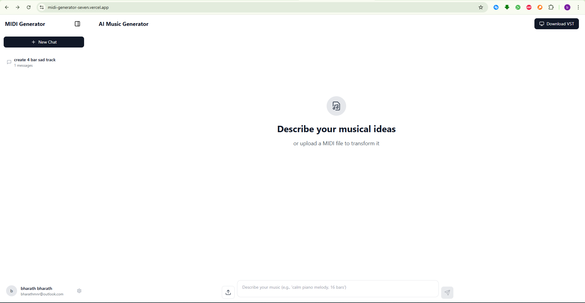
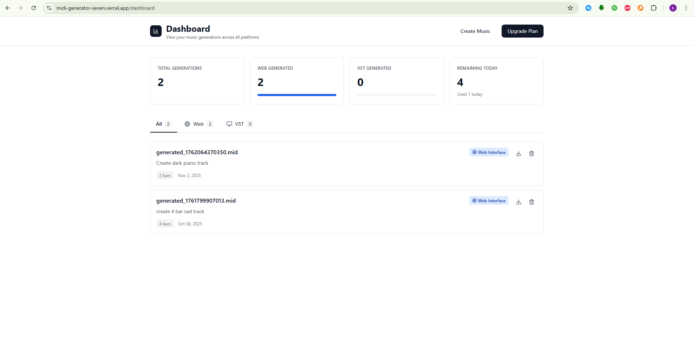
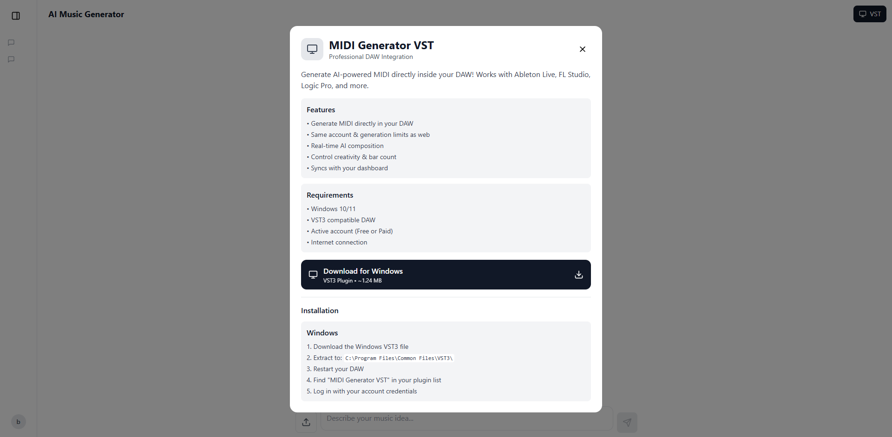
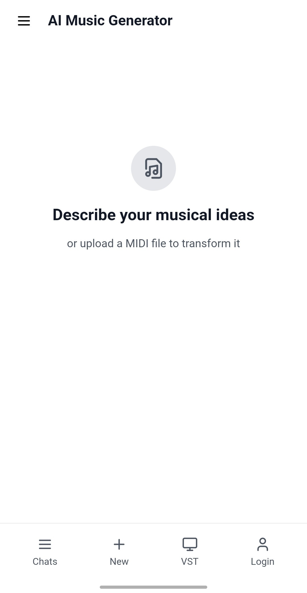
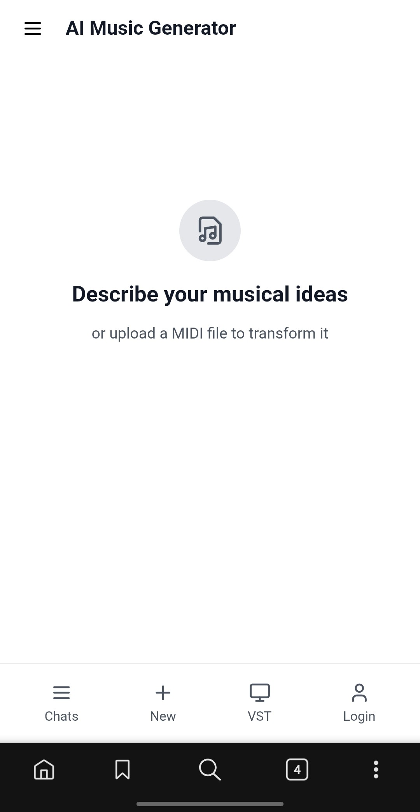
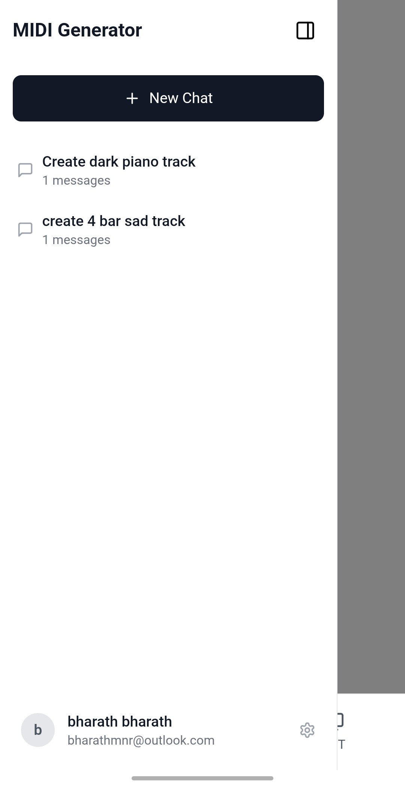
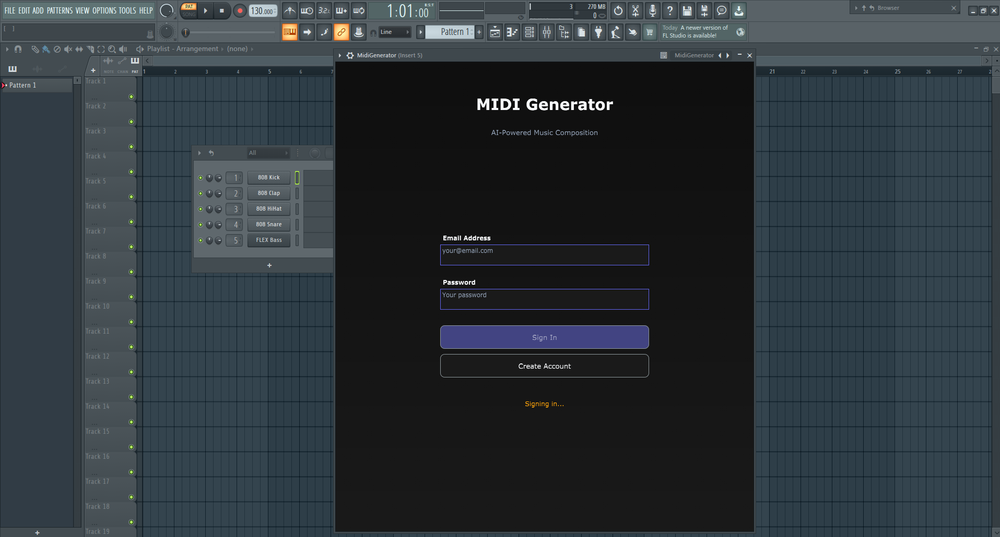
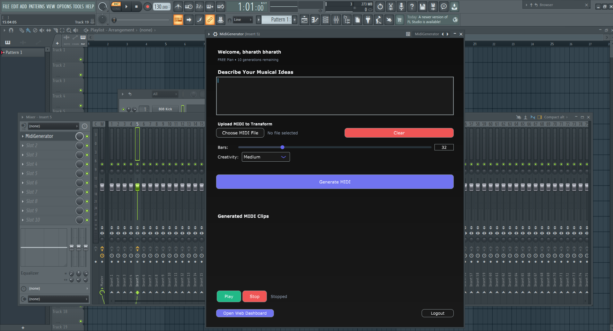
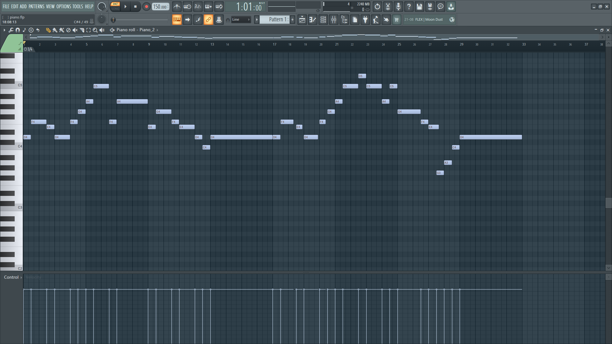
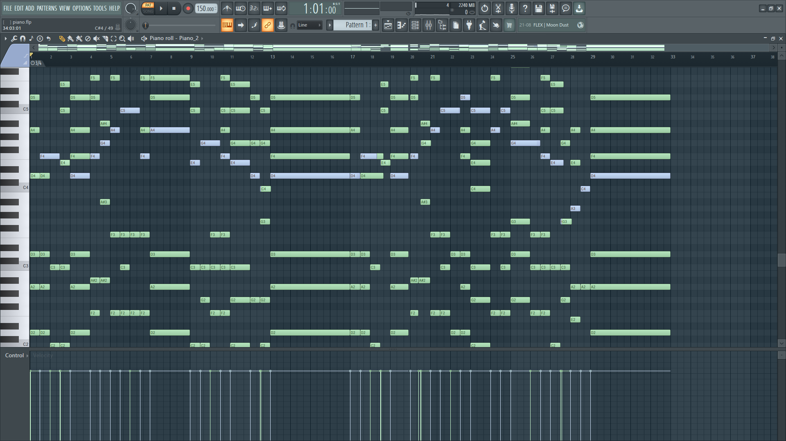

# 🎹 MIDI AI Studio

> AI-powered music composition platform with professional MIDI generation, editing, and style learning capabilities.

## ✨ Features

**💡 Workflow Revolution:** If you have strong theoretical knowledge but lack instrumental proficiency, this tool bridges that gap instantly.


- **AI Music Generation**: Create professional MIDI compositions from text descriptions
- **Reference Style Learning**: Upload MIDI files to teach AI your preferred musical style
- **MIDI Editing**: Upload and edit existing MIDI files with AI assistance
- **Text ↔ MIDI Conversion**: Bidirectional conversion between text notation and MIDI
- **Professional Output**: Support for 1-200 bars with sophisticated harmony and dynamics
- **Real-time Preview**: View MIDI notation before downloading
- **NEW** – **Enterprise-grade Java Backend**: JWT auth, rate-limiting, subscription tiers, chat history, PostgreSQL persistence, horizontal-ready stateless Node.js bridge


## 📸 Gallery

<!-- Row 1: Frontend 4 full width (same style as row 2) -->
<p align="center">
  <a href="images/frontend.png" target="_blank">
    
  </a>
</p>

<p align="center">
  <a href="images/dashboard.png" target="_blank">
    
  </a>
</p>

<p align="center">
  <a href="images/vst_download.png" target="_blank">
    
  </a>
</p>


<!-- Row 2: Mobile Screenshots (vertical) -->
<p align="center">
  <a href="images/mobile_1.jpg" target="_blank">
    
  </a>
  <a href="images/mobile_2jpg" target="_blank">
    
  </a>
  <a href="images/mobile_3.jpg" target="_blank">
    
  </a>
</p>

<!-- Row 3: VST Screenshots (side-by-side) -->
<p align="center">
  <a href="images/vst_1.png" target="_blank">
    
  </a>
  <a href="images/vst_2.png" target="_blank">
    
  </a>
</p>


## 🎨 Example: Orchestral Harmony Enhancement

### Original MIDI (Before)

*Simple melody line (33 bars)*

### AI-Enhanced Result (After)

*Full orchestral arrangement with 5-part harmony*

Prompt Used:
Keep the main melody fully intact and positioned in the high register.
Do not alter or revoice the melody in any way — it remains exactly as written.
Add rich orchestral harmony layers beneath the melody, forming at least
5-part harmony for a full ensemble texture.
Maintain smooth voice leading and overall orchestral balance, ensuring
a deep, lush harmonic texture throughout.
Keep the total structure exactly 33 bars.
Use cinematic or symphonic voicing principles:
High range (D4–A6): Melody remains clear and dominant.
Upper-mid range (G3–G5): Light harmonic or supportive lines.
Middle range (C3–C5): Core harmonic foundation and color tones.
Lower range (C2–C4): Deep harmonic reinforcement and root tones.
Sub-low range (E1–C3): Optional octave or bass grounding.
Keep the harmony openly spaced in lower registers and closer in upper
registers for natural cinematic warmth.
Preserve the melody as the clear focal point, while the underlying
harmony moves slowly, legato, and dynamically supportive, never
rhythmically intrusive.
The final sound should be lush, emotive, and fully cinematic, maintaining
clarity, warmth, and melodic dominance across all 33 bars.


**Result:** The AI successfully added cinematic harmonic layers across 5 voices while preserving the original melody's position and character, creating a professional orchestral arrangement.

---

## 🚀 Live Demo

https://midi-generator-seven.vercel.app/


---

## 🛠️ Tech Stack

### Frontend
- React 18 + Vite
- Tailwind CSS
- Lucide React Icons
- React Router (client-side routing)

### Backend – Dual Layer
1. **Node.js Stateless Bridge** (port 5000)
   - Express + Multer
   - Google Gemini AI API
   - Custom MIDI Parser & Generator
   - In-memory operation – no persistence
2. **Java Spring-Boot API** (port 8080)
   - Spring Security + JWT
   - PostgreSQL / JPA
   - Subscription tiers & daily limits
   - Chat-history & file-proxy endpoints
   - Rate-limiting & scheduled clean-ups

---

## 📋 Prerequisites

- Node.js 18+ and npm
- JDK 21+ and Maven 3.8+
- PostgreSQL 13+ (local or cloud)
- Google Gemini API Key ([Get one here](https://makersuite.google.com/app/apikey))
- Git

---

## 🏃 Local Development

### 1. Clone Repository
```bash
git clone https://github.com/bharath-mnr/ai-midi-generator
cd ai-midi-generator
2. Install Dependencies
bash

# Node layer
cd backend && npm install

# Java layer
cd ../midigenerator && mvn clean install -DskipTests
3. Configure Environment Variables
Node.js bridge (backend/.env):
env

GEMINI_API_KEY=your_google_gemini_api_key_here
PORT=5000
Java API (midigenerator/src/main/resources/application-local.properties):
properties

spring.datasource.url=jdbc:postgresql://localhost:5432/midi_db
spring.datasource.username=postgres
spring.datasource.password=postgres
jwt.secret=change-me-in-production
Frontend (frontend/.env):
env

VITE_API_URL=http://localhost:8080/api
4. Run Development Stack
bash

# Terminal 1 – PostgreSQL (Docker one-liner)
docker run --name midi-postgres -e POSTGRES_PASSWORD=postgres -p 5432:5432 -d postgres:15

# Terminal 2 – Java backend
cd midigenerator && mvn spring-boot:run -Dspring.profiles.active=local

# Terminal 3 – Node bridge
cd backend && npm run dev

# Terminal 4 – React frontend
cd frontend && npm run dev
Access points:
React: http://localhost:5173
Java API: http://localhost:8080/api
Node bridge: http://localhost:5000/api
Swagger UI: http://localhost:8080/swagger-ui.html
🎵 MIDI Text Notation Format
(unchanged – see original docs)
🎹 Usage Examples
(unchanged – see original docs)
🔧 Configuration
(unchanged – see original docs)
📊 API Endpoints
Node.js Stateless Bridge

POST  /api/chat                 # AI → MIDI (stateless)
POST  /api/upload-midi          # MIDI → text
GET   /api/health               # health
Java Spring-Boot API
C
POST  /api/auth/signup          # user registration
POST  /api/auth/login           # JWT login
POST  /api/auth/refresh         # refresh token
POST  /api/auth/verify-email    # email confirmation
POST  /api/midi/generate        # proxy to Node (auth required)
GET   /api/user/profile         # user data
GET   /api/user/generation-limit
GET   /api/midi/generations     # paginated history
GET   /api/midi-files/{name}    # secure file proxy
GET   /api/pricing/plans        # subscription tiers

🧪 Technical Challenges Solved
NEW – Java layer additions:
Distributed Rate-Limiting: In-memory token bucket with header enrichment
Optimistic Lock Retry: Pessimistic write locks on user row to eliminate daily-count race conditions
SendGrid HTTP API: SMTP-port-agnostic email delivery for cloud platforms
Zero-downtime Daily Reset: Single SQL UPDATE at 00:00 UTC, no user interruption
Horizontal Scalability: Stateless Node bridge + shared-nothing Java instances behind any LB

## 🎬 Reference Demo Track  
The orchestral build-up below was generated with the prompt shown earlier.  

https://github.com/user-attachments/assets/676adc35-99de-48c4-b659-5c4df1a5c79a

### Audio Only
🔊 [Download MP3](https://github.com/user-attachments/files/23290756/audio.mp3)


4/4
Tempo: 85
Length: 45 bars

The track should be in 4/4 time signature with a tempo of 85.
It should be a progressive, orchestral-style piece that builds in intensity over time, starting with lower velocities and simpler patterns, gradually increasing in complexity and dynamics to a climax, and then fading out towards the end.
Use sustains (~) to create legato phrases and ensure the note velocities follow the dynamic ranges (e.g., ppp to fff).
Include multiple bars (e.g., 45 bars) with varying chord progressions and arpeggiated patterns, focusing on bass notes (e.g., D2, A2) and higher registers (e.g., D6, A5) for texture.
Avoid including the Key metadata to keep it neutral, and strictly adhere to the spacing rules for 4/4 time.

📝 License
MIT – see LICENSE file.
🎯 Roadmap
[ ] Stripe checkout integration (Java layer ready)
[ ] VST3 plugin (works via Node bridge)
[ ] Admin dashboard (Spring-Actuator + custom endpoints)
[ ] WebSocket real-time generation progress
[ ] Mobile app (consumes same Java API)
Enjoy composing! 🎼
